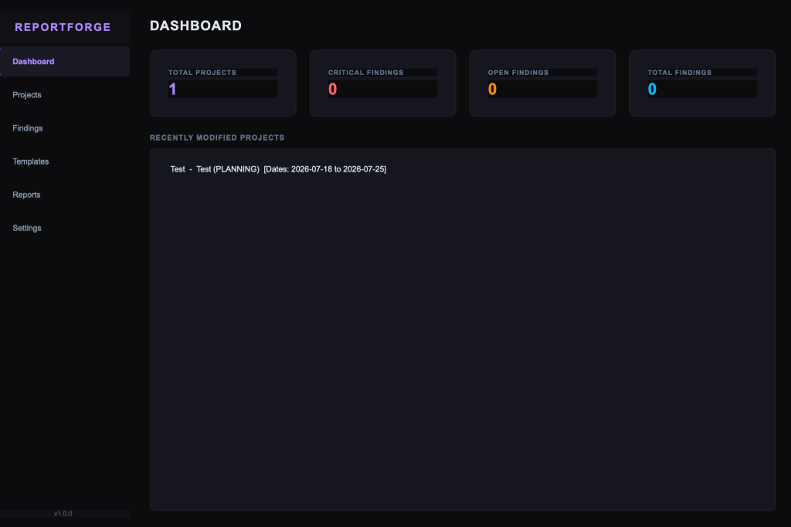
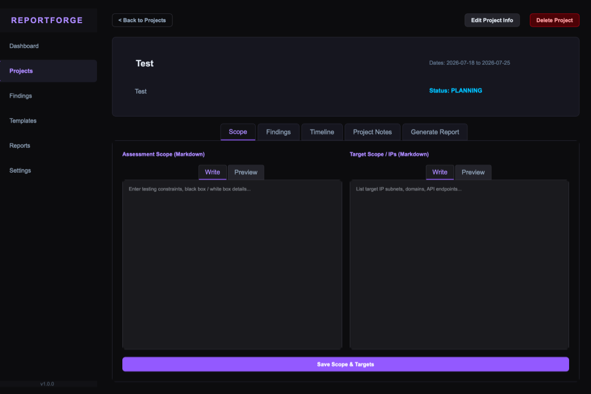
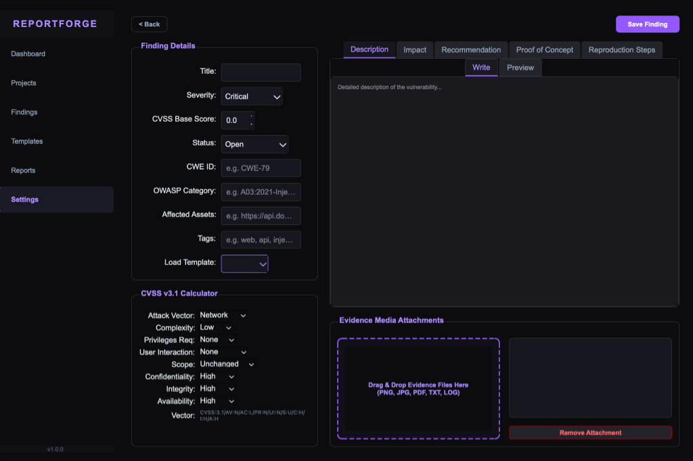
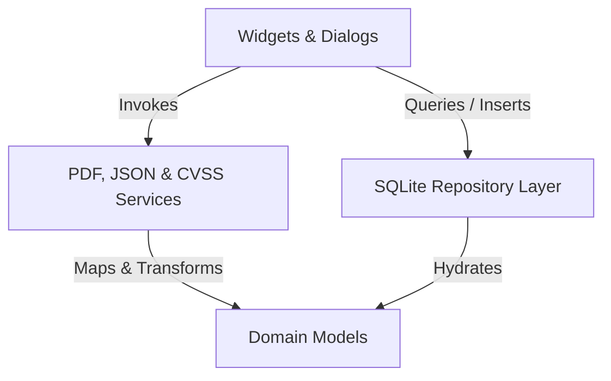

# ReportForge 🛠️🛡️

ReportForge is a professional, high-performance desktop application built in modern C++23 and Qt 6 (Widgets) designed specifically for penetration testers, security auditors, and cybersecurity students. 

Unlike generic note-taking tools, **ReportForge** acts as a structured lifecycle manager for security assessments—handling target scopes, logging vulnerabilities via pre-seeded templates, computing live CVSS v3.1 scores, storing evidence media attachments locally, and compiling executive-ready PDF reports.

---

## 🖼️ Screenshots

### Dashboard View


### Project Scope Tab


### Finding Details & CVSS Calculator


---

## 📸 Key Features

*   **Sleek Dark Cyber UI**: Tailored visual experience built with custom Qt stylesheets featuring a dark-theme palette with violet and cyan highlights.
*   **Structured Assessment Workspace**: Dedicated tab panels for Timeline logs, Target scopes, Findings listings, and internal Markdown project notes.
*   **Automatic SQLite Migrations & Template Seeding**: Bootstraps its database schemas automatically and pre-seeds **8 standard industry vulnerability templates** (SQL Injection, Stored XSS, IDOR, CSRF, SSRF, RCE, Directory Traversal, and Broken Authentication) which fill descriptions and remediation fields in a single click.
*   **Live CVSS v3.1 Calculator**: Select exploitability and impact metrics (AV, AC, PR, UI, S, C, I, A) in real-time, displaying the official vector string (e.g. `CVSS:3.1/AV:N/...`) and adjusting the severity rating dynamically.
*   **Drag & Drop Evidence Attachments**: Drag images, HTTP logs, or text payloads directly into the UI. The app safely organizes and hashes them into `./evidence/project_{id}/`, automatically scaling and embedding screenshots in PDF reports.
*   **Enterprise-Grade PDF Report Generator**: Utilizes a custom **two-pass layout engine** to generate highly styled deliverables featuring:
    *   Premium Dark Cover Page with confidentiality metadata.
    *   Dynamic Table of Contents with dotted leaders.
    *   Visual severity distribution grid cards (Critical, High, Medium, Low, Info).
    *   Chronological assessment timeline tracking graphic.
    *   Visual findings detailed blocks with monospace code payload cards and captioned screenshots.
    *   Reference appendix for CVSS ratings.
*   **Validation Warnings Check**: Analyzes findings before compiling the report, alerting the user about missing descriptions, recommendations, or screenshot evidence to prevent incomplete deliverables.

---

## 🏗️ Architecture Flow

ReportForge follows a Clean Architecture design, decoupling business rules, data repositories, and UI widgets:



---

## 🛠️ Build and Compilation Guide

### Prerequisites
To build ReportForge, you need:
*   A C++ compiler supporting **C++23** (Apple Clang 15+, GCC 13+, or MSVC 2022+).
*   **CMake** (Version 3.20 or newer).
*   **Qt 6 SDK** (Core, Gui, Widgets, Sql, Pdf, PdfWidgets modules).
*   A build generator like **Ninja** (recommended) or Make/MSBuild.

---

### 🍎 Compilation on macOS

1.  **Install dependencies** (using Homebrew):
    ```bash
    brew install qt cmake ninja
    ```
2.  **Configure the build**:
    If Qt is installed via Homebrew or a manual path, specify your `CMAKE_PREFIX_PATH`:
    ```bash
    cmake -B build -G Ninja -DCMAKE_PREFIX_PATH=/opt/homebrew/opt/qt
    ```
3.  **Compile the binary**:
    ```bash
    cmake --build build --parallel
    ```
4.  **Run the application**:
    ```bash
    ./build/bin/ReportForge
    ```

---

### 🐧 Compilation on Linux (Debian/Ubuntu)

1.  **Install dependencies**:
    ```bash
    sudo apt update
    sudo apt install build-essential cmake ninja-build qt6-base-dev qt6-pdf-dev
    ```
2.  **Configure and Compile**:
    ```bash
    cmake -B build -G Ninja
    cmake --build build --parallel
    ```
3.  **Run the application**:
    ```bash
    ./build/bin/ReportForge
    ```

---

### 🪟 Compilation on Windows

1.  **Install Tools**:
    *   Install Visual Studio 2022 (with "Desktop development with C++" workload).
    *   Install CMake and Qt 6 via the official Qt Online Installer.
2.  **Configure and Compile (using Developer Command Prompt)**:
    ```cmd
    cmake -B build -G "Visual Studio 17 2022" -A x64 -DCMAKE_PREFIX_PATH=C:\Qt\6.x.x\msvc2022_64
    cmake --build build --config Release --parallel
    ```
3.  **Run the application**:
    ```cmd
    .\build\bin\Release\ReportForge.exe
    ```

---

## 🔒 Security & Data Privacy

ReportForge is built for local privacy:
*   All client metadata, findings, and evidence assets remain on your **local machine**.
*   The SQLite database (`reportforge.db`) and the evidence media files (`evidence/`) are added to the `.gitignore` to prevent confidential assessment details from accidentally leaking into public Git repositories.

---

## 📄 License

This project is licensed under the **MIT License** - see the [LICENSE](LICENSE) file for details.
